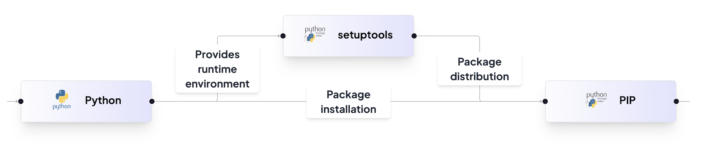

# Akanksha - A Python Package for Displaying My Resume 📜

Welcome to the **`akanksha`** package! This Python package allows you to easily access my resume directly from your terminal. It's a creative and fun way to showcase my skills, experience, and journey in the tech world.

## Executive Summary

The **Akanksha** Python package is designed to streamline the process of sharing and accessing a developer's resume directly from the terminal. By offering a structured and interactive presentation, the package improves operational efficiency and enhances the user experience for both developers and potential employers.

### Key Benefits:
- **Increased Operational Efficiency:** Simplifies resume sharing without the need for multiple documents or websites.
- **Cost Savings & Competitive Advantage:** Offers a self-contained, engaging resume presentation method.
- **Improved Scalability & Performance:** Modular design allows easy maintenance and updates.
- **Enhanced Collaboration & Knowledge Sharing:** Facilitates standardized resume presentation for better communication.

## Architecture
To understand the package structure and workflow, refer to the image:


## Feature Overview

### **Purpose**
The Akanksha package provides a seamless and interactive way for users to display a developer's resume directly from the terminal. It ensures an organized presentation of skills, experiences, and projects.

### **Key Components**
- **Resume Class:** Represents the developer’s resume, including personal details, technical skills, education, and project information.
- **Display Method:** Prints resume details in a structured and readable format.
- **Show Resume Function:** Instantiates the `Resume` class and calls the display method.

### **Functionality**
- The package is installed via `pip`, and the `akanksha` command displays the resume.
- Data is structured using Python classes, dictionaries, and lists.
- The package is designed for easy updates and extension without modifying core functionality.

## Installation & Usage

### **Installation**
```sh
pip install akanksha
```

### **Usage**
```sh
akanksha
```
This command displays the resume in a structured format directly in the terminal.

## Services Used
The package leverages the following third-party services:
- **Setuptools:** Used for package management in `setup.py`.
- **Python:** Core programming language for package development.
- **PIP (Python Package Index):** Package distribution and installation.

## Feature Hierarchy

### **1. Resume Display Package**
- **Installation & Execution:** Users can install the package using `pip` and run the `akanksha` command.
- **Content Presentation:** Displays structured resume details interactively.

### **2. Package Setup & Configuration**
- **Package Metadata:** Defines package details (name, version, author, license, compatibility).
- **Console Script Configuration:** Sets up a CLI command (`akanksha`) for resume display.

### **3. Resume Management**
- **Resume Display:** Formats and presents the developer’s resume with personal details, skills, education, and projects.

## Contributing
Contributions are welcome! Please follow standard GitHub workflows to submit changes.

## License
This project is licensed under the MIT License.

## Contact
For any inquiries or feature requests, reach out to the developer through GitHub or email.

## Future Enhancements
- **Interactive Mode:** Allow users to navigate through different sections of the resume.
- **Customizable Themes:** Provide users with different styling options for terminal output.
- **Export Options:** Enable exporting the resume in formats like PDF or Markdown.

Stay tuned for updates!
